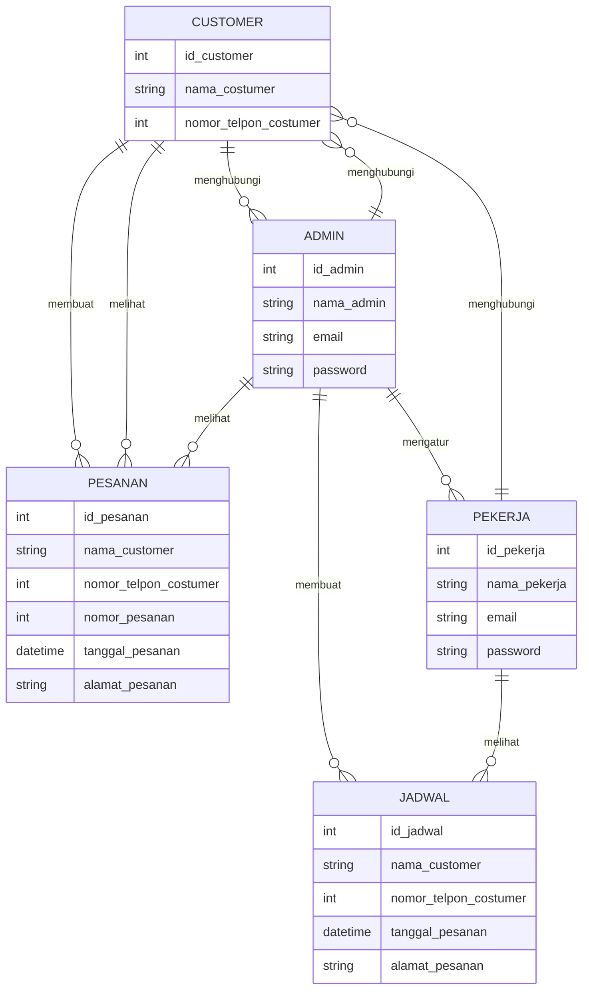
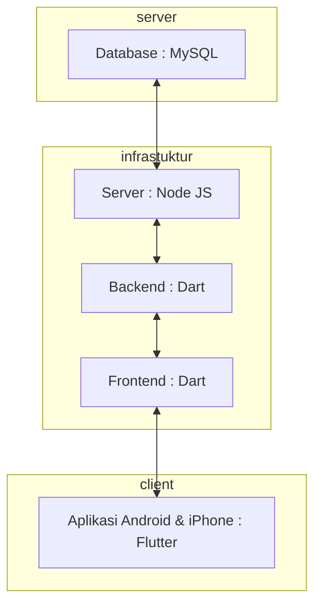

# Membuat Aplikasi Sewa Jasa Sound System Menggunakan Flutter, Dart, Node JS, Express dan MySQL
Muhammad Agung Julyansyah , Oct 15 2023

### 1.1. Latar Belakang

Aplikasi ini adalah solusi yang merespon kebutuhan masyarakat yang ingin dengan mudah memesan atau menyewa jasa sound system untuk berbagai jenis acara seperti pesta ulang tahun, konser kecil, konferensi, pernikahan, dan acara lainnya. Latar belakang yang mendorong pembuatan aplikasi ini karena begitu banyaknya oknum oknum yang tidak jujur, seperti menipu dan lain lain. Adanya aplikasi ini menjadi sebuah solusi untuk memesan jasa Sound System dan Hiburan dengan aman, mudah, dan nyaman.

### 1.2. Deskripsi

Aplikasi ini dirancang untuk menjadi platform yang memungkinkan pengguna untuk, Memesan jasa sound system untuk tanggal dan waktu tertentu, Melakukan pembayaran dengan aman, baik melalui kartu kredit atau metode pembayaran lainnya yang didukung, Melacak status pesanan mereka dan menerima notifikasi penting, Memberikan ulasan dan umpan balik tentang penyedia jasa setelah acara selesai, Memberikan informasi kepada pelanggan yang lebih detail dan rinci dan Memberikan informasi kepada pekerja sound system.

### 1.3. Branding

- Merk : AJS Sound System & Entertaintment

- Logo : Logo khas "AJS Sound System & Entertaintment" yang telah dikenal masyarakat secara luas.

- Campaign : "Sound System Solution at Your Fingertips".

- Target User :
  
  - Usia 18+
  
  - Seorang yang membutuhkan jasa sewa Sound System atau Hiburan

- User Interface :
  
  - Mudah dan Sederhana.
  
  - Warna : Putih , Biru Tua, Gold Warna yang terkesan profesional dan memberikan kesan mewah.
  
  - Inspirasi Design :
 

### 2. User Story
Tahap ini menjelaskan tentang prioritas antara Admin, Pekerja dan Customer untuk  mewujudkan fitur-fitur yang sudah dirancanakan pada aplikasi yang akan dibuat.

Sebagai | Saya ingin bisa | Sehingga | Prioritas
---|------|------|---
Customer | Melakukan pemesanan atau pembelian | Bisa Memesan Sound System | ⭐️⭐️⭐️⭐️⭐️
Customer | Mengatur tanggal pemesanan | Bisa memesan di tanggal yang diinginkan | ⭐️⭐️⭐️⭐️⭐️
Customer | Mengatur alamat tujuan pemesanan | Bisa memesan dengan alamat yang benar dan tepat | ⭐️⭐️⭐️⭐️⭐️
Customer | Melihat status pesanan | Bisa mengetahui hal yang terjadi pada pesanan saya | ⭐️⭐️⭐️⭐️
Admin | Melihat detail per tanggal | Bisa mengetahui apakah di tanggal tersebut ada acara dan jikalau ada itu dimana | ⭐️⭐️⭐️⭐️⭐️
Admin | Melihat detail pesanan | Bisa mengatur pemberangkatan pesanan | ⭐️⭐️⭐️⭐️⭐️
Admin | Mengatur user pekerja | Bisa mengkondisikan pekerja terhadap pesanan pelanggan | ⭐️⭐️⭐️⭐️⭐️
Admin | Membuat jadwal manggung | Pekerja bisa mengetahui kapan ia harus pergi dan kemana tujuannya | ⭐️⭐️⭐️⭐️⭐️
Pekerja | Melihat jadwal dalam setiap tanggal | Bisa mengetahui kapan harus bekerja | ⭐️⭐️⭐️⭐️⭐️
Pekerja | Melihat alamat pada jadwal yang sudah ditentukan | Diantarkan ke alamat yang tepat | ⭐️⭐️⭐️⭐️⭐️
  
### 3. Struktur Data

### 4. Arsitektur Berbasis Client-Server

Berikut adalah arsitektur dari teknologi - teknologi yang digunakan dalam perancangan / pembuatan aplikasi ini :

### 5. Teknologi, Library dan Framework

Teknologi, Library dan Framework yang digunakan dalam pembuatan aplikasi ini adalah sebagai berikut :

- Bahasa Pemrograman: Dart digunakan di sisi klien (frontend) dengan menggunakan Flutter. Node.js digunakan di sisi server (backend) untuk mengelola aplikasi ini.

- Framework Client: Flutter adalah kerangka kerja yang digunakan untuk mengembangkan aplikasi Android dan iOS. Ini memungkinkan pengembangan aplikasi seluler cross-platform dengan menggunakan bahasa Dart.

- Framework Server: Node.js digunakan sebagai framework server di sisi backend.
  
- Database: MySQL digunakan sebagai sistem manajemen basis data relasional untuk menyimpan dan mengelola data aplikasi.

- Library Tambahan untuk Flutter (Sisi Client): Library http dan dio membantu dalam melakukan permintaan HTTP dari aplikasi Flutter ke server Node.js. Library provider dan flutter_bloc mempermudah pengelolaan aplikasi dan data. Dan library shared_preferences dan flutter_secure_storage membantu dalam penyimpanan data lokal seperti preferensi pengguna dan informasi sensitif secara aman.

- Library Tambahan untuk Node.js (Sisi Server): Library express.js untuk mengembangkan API RESTful yang kuat. Library mysql2 membantu berinteraksi dengan database MySQL. Library axios untuk membuat permintaan HTTP dari server Node.js ke klien Flutter. Dan jsonwebtoken untuk mengimplementasikan otentikasi berbasis token, karena saya disini menggunakan multi-role login yang dimana ada Admin, Pekerja, dan User.

- Infrastruktur Hosting: Heroku, platform hosting yang akan digunakan untuk menjalankan server Node.js. Seperti menyediakan infrastruktur, manajemen server, dan sumber daya yang dibutuhkan. Anda dapat mendeploy dan mengelola aplikasi Node.js.
  
- Perangkat Lunak Server: Nginx, server web dan proxy reverse yang akan mengatur lalu lintas HTTP ke aplikasi Node.js. Ini mengelola penyeimbangan beban, caching, dan lapisan keamanan. Nginx ini juga bisa membantu meningkatkan kinerja dan keamanan aplikasi.

### 6. User Experience (UX) Design
  

Design ini adalah low fidelity design yang dimana design yang paling sederhana untuk dibuat, design ini dibuat di aplikasi Notes di iPhone.

### 7. Demonstrasi video

-

### 8. Bagaimana mesin komputasi dan sistem operasi berperan dalam produk teknologi informasi ?

Dalam produk teknologi informasi ini, mesin komputasi (Laptop) dan sistem operasi (MacOS) berperan sebagai infrastruktur dasar. Mesin komputasi berfungsi sebagai server yang menjalankan aplikasi backend dan menyimpan basis data MySQL. Sistem operasi digunakan untuk mengelola sumber daya komputer, menjalankan perangkat lunak, dan memproses permintaan dari aplikasi Flutter. Selain itu, sistem operasi juga berperan dalam keamanan dan manajemen sumber daya server. Intinya, mesin komputasi atau laptop yang digunakan ini sederhananya berperan sebagai pusat aplikasi dari mulai percancangan, pembuatan, dan pengelolaan semua sumber daya ataupun data yang diperlukan di aplikasi mobile yang digunakan client, jadi bisa dikatakan laptop yang digunakan ini sebagai server dan aplikasi mobile nya sebagai client.

### 9. Bagaimana algoritma, struktur data, dan bahasa pemrograman berperan dalam produk teknologi informasimu ?

Algoritma digunakan dalam aplikasi untuk mengatur logika bisnis, algoritma pencarian, manajemen pesanan, dan pencarian data. Struktur data digunakan untuk menyimpan informasi pelanggan, pesanan, jadwal, dan sebagainya dalam basis data MySQL. Bahasa pemrograman Dart digunakan untuk mengembangkan aplikasi Flutter di sisi client. Algoritma dan struktur data berperan dalam efisiensi dan kehandalan aplikasi, sedangkan bahasa pemrograman berperan untuk memerintah komputer untuk menjalankan fungsi-fungsi atau algoritma yang dibutuhkan dalam aplikasi ini.

### 10. Bagaimana metode pengembangan perangkat lunak / Software Development Life Cycle berperan dalam produk teknologi informasimu ?

Metode pengembangan perangkat lunak atau Software Development Life Cycle adalah kerangka kerja yang digunakan untuk mengelola siklus  pengembangan perangkat lunak. Dalam produk ini, SDLC berperan dalam mengatur tahap-tahap pengembangan aplikasi, mulai dari perencanaan, analisis, desain, implementasi, pengujian, dan pemeliharaan. SDLC memastikan bahwa pengembangan aplikasi berjalan secara terstruktur dan sesuai dengan kebutuhan pengguna.

### 11. Bagaimana database / sistem basis data berperan dalam produk teknologi informasimu ?

Database MySQL berperan sebagai tempat penyimpanan semua data yang diperlukan oleh aplikasi, seperti informasi pelanggan, pesanan, jadwal, dan detail lainnya. Sistem basis data berperan dalam mengatur, mengelola, dan menyediakan akses data. Hal ini memungkinkan aplikasi untuk CRUD dengan efisien. Database juga berperan dalam menjaga konsistensi dan kerapihan data, serta memungkinkan pencarian dan pengambilan data yang cepat.

