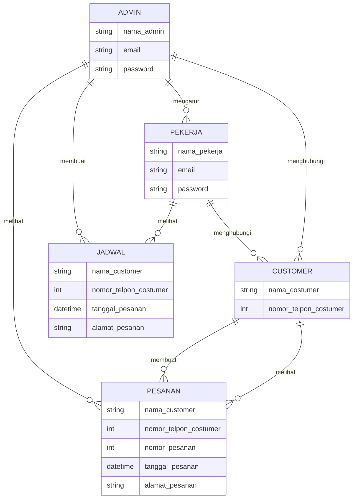
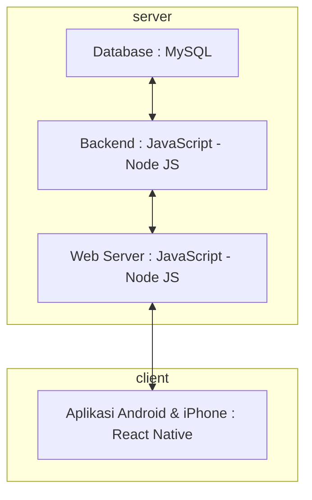

# Membuat Aplikasi Sewa Jasa Sound System Menggunakan React Native, Node JS, Express dan MySQL
Muhammad Agung Julyansyah , Oct 15 2023

### 1.1. Latar Belakang

Aplikasi ini adalah solusi yang merespon kebutuhan masyarakat yang ingin dengan mudah memesan atau menyewa jasa sound system untuk berbagai jenis acara seperti pesta ulang tahun, konser kecil, konferensi, pernikahan, dan acara lainnya. Latar belakang yang mendorong pembuatan aplikasi ini karena begitu banyaknya oknum oknum yang tidak jujur, seperti menipu dan lain lain. Adanya aplikasi ini menjadi sebuah solusi untuk memesan jasa Sound System dan Hiburan dengan aman, mudah, dan nyaman.

### 1.2. Deskripsi

Aplikasi ini dirancang untuk menjadi platform yang memungkinkan pengguna untuk, Memesan jasa sound system untuk tanggal dan waktu tertentu, Melakukan pembayaran dengan aman, baik melalui kartu kredit atau metode pembayaran lainnya yang didukung, Melacak status pesanan mereka dan menerima notifikasi penting, Memberikan ulasan dan umpan balik tentang penyedia jasa setelah acara selesai, Memberikan informasi kepada pelanggan yang lebih detail dan rinci dan Memberikan informasi kepada pekerja sound system.

### 1.3. Branding

- Merk : AJS Sound System & Entertaintment

- Logo : Logo khas "AJS Sound System & Entertaintment" yang telah dikenal masyarakat secara luas.

- Campaign : "Sound System Solution at Your Fingertips".

- Target User :
  
  - Usia 18+
  
  - Seorang yang membutuhkan jasa sewa Sound System atau Hiburan

- User Interface :
  
  - Mudah dan Sederhana.
  
  - Warna : Putih , Biru Tua, Gold Warna yang terkesan profesional dan memberikan kesan mewah.
  
  - Inspirasi Design :
 

### 2. User Story
Tahap ini menjelaskan tentang prioritas antara Admin, Pekerja dan Customer untuk  mewujudkan fitur-fitur yang sudah dirancanakan pada aplikasi yang akan dibuat.

Sebagai | Saya ingin bisa | Sehingga | Prioritas
---|------|------|---
Customer | Melakukan pemesanan atau pembelian | Bisa Memesan Sound System | ⭐️⭐️⭐️⭐️⭐️
Customer | Mengatur tanggal pemesanan | Bisa memesan di tanggal yang diinginkan | ⭐️⭐️⭐️⭐️⭐️
Customer | Mengatur alamat tujuan pemesanan | Bisa memesan dengan alamat yang benar dan tepat | ⭐️⭐️⭐️⭐️⭐️
Customer | Melihat status pesanan | Bisa mengetahui hal yang terjadi pada pesanan saya | ⭐️⭐️⭐️⭐️
Admin | Melihat detail per tanggal | Bisa mengetahui apakah di tanggal tersebut ada acara dan jikalau ada itu dimana | ⭐️⭐️⭐️⭐️⭐️
Admin | Melihat detail pesanan | Bisa mengatur pemberangkatan pesanan | ⭐️⭐️⭐️⭐️⭐️
Admin | Mengatur user pekerja | Bisa mengkondisikan pekerja terhadap pesanan pelanggan | ⭐️⭐️⭐️⭐️⭐️
Pekerja | Melihat jadwal dalam setiap tanggal | Bisa mengetahui kapan harus bekerja | ⭐️⭐️⭐️⭐️⭐️
Pekerja | Melihat alamat pada jadwal yang sudah ditentukan | Diantarkan ke alamat yang tepat | ⭐️⭐️⭐️⭐️⭐️
  
### 3. Struktur Data

### 4. Arsitektur Berbasis Client-Server

Berikut adalah arsitektur dari teknologi - teknologi yang digunakan dalam perancangan / pembuatan aplikasi ini :

### 5. Teknologi, Library dan Framework

Teknologi, Library dan Framework yang digunakan dalam pembuatan aplikasi ini adalah sebagai berikut :

- React Native: React Native adalah teknologi utama yang dibutuhkan untuk mengembangkan aplikasi seluler cross-platform. Ini memungkinkan untuk membuat aplikasi Android dan iOS dengan menggunakan JavaScript dan React.
  
- Node.js: Node.js adalah teknologi server-side yang akan digunakan untuk mengelola logika aplikasi, menangani permintaan dari aplikasi seluler, dan berinteraksi dengan database MySQL.
  
- MySQL: MySQL adalah sistem manajemen basis data (Database) relasional yang akan digunakan untuk menyimpan dan mengelola data aplikasi, seperti informasi admin, pekerja, customer, pesanan, dan jadwal.
  
- JavaScript: JavaScript adalah bahasa pemrograman yang digunakan untuk mengembangkan aplikasi React Native dan server aplikasi Node.js. Ini adalah bahasa yang digunakan di seluruh tumpuan teknologi ini.
  
- React Native Elements atau NativeBase: Library komponen UI yang dapat membantu dalam membangun tampilan aplikasi dengan mudah. Ini menyediakan komponen siap pakai seperti tombol, form, dan lainnya.
  
- Express.js: Framework server web Node.js yang akan membantu dalam mengembangkan API RESTful untuk berkomunikasi antara aplikasi React Native dan database MySQL.
  
- Axios: Library yang berguna untuk melakukan permintaan HTTP dari aplikasi React Native ke server Node.js, atau lebih sederhananya Axios adalah library yang digunakan untuk menghubungkan backend ke frontend dan sebaliknya.

### 6. User Experience (UX) Design
  

Design ini adalah low fidelity design yang dimana design yang paling sederhana untuk dibuat, design ini dibuat di aplikasi Notes di iPhone.
